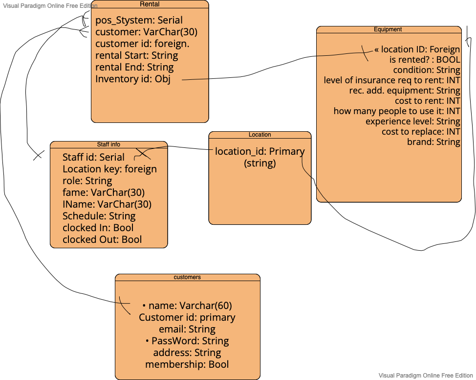

# Wavetree.io

## Where io means indoors/outdoors!

#### Outdoor Equipment Rentals

We want to create the api for an outdoor rental business.

Let's think about some the data we may need just to get you started.

As you build out your ERD, you may want to add, remove and change what is here, depending on how you end up visualizing this business

- customers

  - name
  - address
  - membership (trial, single, family, corporate discount)

- store locations

  - address
  - staff
  - equipment on hand

- staff info

  - you've got this!

- rental

  - staffer who made the transaction
  - customer
  - inventory
  - rental start
  - rental end

- equipment
  - type (water, winter etc.)
  - store location
  - is rented?
  - condition (new, excellent, fair - maybe a photo for insurance purposes?)
  - level of insurance required to rent
  - recommended additional equipment (ie if kayak, then life vest, oars, first aid kit, roof rack....)
  - cost to rent
  - how many people to use it (single, pair, group...)
  - experience level (novice, expert)
  - cost to replace
  - brand

Further resources:

- [What is an entity relationship digram?](https://www.visual-paradigm.com/guide/data-modeling/what-is-entity-relationship-diagram/)

## Lab Submission

In Canvas, add relevant text and links to your work.

